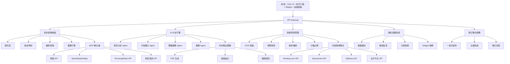

# 協同旅行規劃 AI 系統設計

## 系統概述

一個多用戶協同的智能旅行規劃系統，透過自然語言對話收集需求，自動生成最佳化行程，並提供即時協作、費用管理、通知提醒與列印輸出功能。整合天氣預報、匯率查詢、預算管控與一站式預訂服務。

## 核心功能架構

### 1. 使用者流程
1. **出發前討論**：使用者在群組中發起「京都三日行」討論，AI 自動生成初版行程並標註待確認項目
2. **共同編輯**：成員透過 Chat UI 或快捷按鈕提出新增景點或調整時段，系統即時更新行程草案
3. **預訂與確認**：在行程確認後，透過一頁式搜尋介面比價並完成航班與飯店預訂
4. **旅行中提醒**：行程當天，系統推播交通出發提醒、天氣變化通知與即時路線導航
5. **消費記錄與結算**：出遊期間拍照記帳，行程結束前由 AI 發送分帳報告並催促結算

### 2. 群組協作模組

**多用戶聊天室**
- 支援即時討論景點偏好
- NLP 解析用戶提及的景點、時間、預算限制
- 投票機制：群組成員對景點/餐廳進行優先級投票

**協同編輯系統**
- **共享草案**：每位成員皆可在聊天群組中發起行程討論，AI 自動匯整討論重點並更新草案
- **版本控制**：記錄每次編輯歷史，並允許回復至先前版本，避免衝突與重工
- **角色權限**：可設定「管理者」、「可編輯」與「僅評論」等權限，確保協作秩序

**快速操作介面**
- **快捷按鈕**：在輸入框旁放置「建議行程」「新增景點」「分帳記帳」等快捷標籤
- **快速指令**：支援 `/weather`, `/budget`, `/add [景點]` 等指令
- **一鍵操作**：常用功能如「平均分帳」「匯出行程」提供單擊完成

### 3. 智能分析引擎

```
Agent Workflow Pipeline:
用戶討論 → 需求提取 → 資料查詢 → 行程優化 → 結果呈現
```

**核心 Agents**
- **需求分析 Agent**：解析群組對話，提取景點、時間、預算、偏好
- **資料查詢 Agent**：調用 MCP 獲取景點資訊
- **行程優化 Agent**：基於約束條件生成最佳路線
- **協調 Agent**：整合各 Agent 結果，處理衝突
- **應變調整 Agent**：支援滾動式調整，當行程被打亂時，以最快速度分析新行程

### 4. 旅遊清單推薦系統

**智能推薦引擎**
- **個人化推薦**：基於用戶歷史偏好、評價與行為模式推薦景點
- **群組偏好分析**：綜合群組成員喜好，找出共同興趣點
- **動態調整**：根據天氣、季節、當地活動即時調整推薦內容
- **多維度篩選**：依據預算、時間、距離、評分等條件篩選景點

**推薦類別**
- 必訪景點：當地知名地標與文化景點
- 美食推薦：特色餐廳、小吃攤、米其林餐廳
- 購物區域：商圈、特色市集、免稅店
- 體驗活動：文化體驗、戶外活動、季節限定
- 交通建議：最佳路線、交通工具選擇

### 5. 通知與提醒系統

**行前提醒**
- **交通出發提醒**：基於地點與時間，推送「交通出發」「抵達飯店」等行前提醒通知
- **文件檢查**：提醒攜帶護照、機票、訂房確認等重要文件
- **天氣預報**：出發前一天推送目的地天氣預報與建議穿著

**即時異常提示**
- **航班延誤**：即時監控航班狀態，延誤時推播通知並建議調整行程
- **天氣變化**：極端天氣時以推播、紅旗標示或對話橫幅方式通知
- **預訂異常**：飯店或餐廳預訂變更時立即通知相關成員

**日程快照**
- **今日行程總覽**：每日行程開始前，發送「今日行程總覽」卡片
- **Widget 支援**：提供手機 Widget 顯示關鍵資訊（下個行程、天氣、交通時間）
- **進度追蹤**：即時更新行程進度與預估到達時間

### 6. 外部資料整合 (MCP)

**地圖與路線 MCP**
- Google Maps API：景點資訊、評價、開放時間
- 路線規劃：最佳化交通時間與成本
- 即時交通狀況

**天氣預報 MCP**
- **OpenWeatherMap 整合**：提供 5-7 天詳細天氣預報
- **行程卡片顯示**：在每日行程卡片中顯示當地天氣圖示、溫度、降雨機率
- **穿搭建議**：根據天氣自動推薦適合的服裝類型

**匯率查詢 MCP**
- **ExchangeRate-API 整合**：提供即時匯率查詢
- **多幣別支援**：支援主要貨幣與當地貨幣轉換
- **行程卡片顯示**：在景點介紹中顯示門票價格的本地貨幣換算

**旅遊資訊 MCP**
- TripAdvisor/Yelp 評價整合
- 景點票價與營業時間
- 當地活動與節慶資訊

### 7. 航班與飯店預訂整合

**一頁式搜尋介面**
- **整合搜尋**：同時搜尋航班與飯店，提供套裝與分別預訂選項
- **進階篩選**：日期、價格區間、航班直飛/轉機、飯店星級、設施篩選
- **地圖檢視**：在地圖上顯示飯店位置與距離景點的便利性

**比價卡片系統**
- **多平台整合**：串接 Booking.com、Hotels.com、Expedia、Skyscanner
- **價格標籤**：自動標註「最省」「推薦」「最快」等標籤
- **評價整合**：顯示各平台評分與近期評論摘要

**詳情頁與快訂**
- **航班詳情**：展示航線圖、機型、行李政策、座位選擇
- **飯店詳情**：房型照片、設施列表、取消政策、位置優勢
- **響應式預訂**：「立即預訂」按鈕導向合作平台或內建預訂流程

### 8. 智能預算管理系統

**消費記錄增強**
- **拍照辨識**：以 OCR 拍照掃描發票，AI 自動解析金額、商家、日期並分類
- **手動輸入**：支援快速手動輸入消費項目
- **自動分類**：智能分類為交通、餐飲、住宿、門票、購物等類別
- **即時匯率轉換**：自動將當地貨幣轉換為用戶設定的基準貨幣

**預算管控**
- **票券價格預估**：基於景點門票、交通費用自動計算預估花費
- **預算追蹤**：即時顯示已花費金額與剩餘預算
- **超支警示**：當消費接近預算上限時推送提醒
- **消費建議**：根據剩餘預算推薦適合的餐廳或活動

**分帳管理**
- **智能分帳**：提供「平均分」「按消費比例」「自訂金額」等分帳方式
- **成員參與選擇**：每筆消費可選擇參與分帳的成員
- **即時預覽**：分帳方式變更時即時顯示每人應付金額
- **貨幣統一**：所有分帳以統一貨幣計算，避免匯率混亂

**財務總覽**
- **成員負債總覽**：以列表或圓餅圖形式展示每人應付／應收狀況
- **一鍵結算**：支援「一鍵結算」導向 Splitwise 或 PayPal
- **歷史記錄與報表匯出**：可匯出 CSV 或 PDF 報表

### 9. 增強行程卡片系統

**智能行程卡片**
- **天氣整合**：每日行程卡片顯示天氣圖示、溫度、降雨機率
- **匯率顯示**：景點門票、餐廳價格同時顯示當地貨幣與換算價格
- **預算提示**：顯示該日預估花費與剩餘預算
- **交通資訊**：顯示前往下個景點的交通方式與預估時間

**動態更新**
- **即時天氣**：根據天氣變化自動調整室內外活動建議
- **交通狀況**：整合即時交通資訊，推薦最佳路線
- **價格變動**：監控票券價格變化，提供最佳購買時機

### 10. 可視化與列印輸出

**時程表可視化**
- 甘特圖式行程排程
- 地圖標記景點路線
- 天氣與交通狀況整合顯示

**列印友好輸出**
- **一鍵生成旅遊小冊子**：包含行程介紹、地點介紹、旅遊日程的完整PDF檔案
- **客製化版面**：支援不同頁面尺寸與排版風格
- **離線查閱**：包含景點地址、聯絡方式、營業時間等重要資訊

## 安全與隱私

**資料保護**
- **資料加密**：傳輸層採 TLS，敏感資訊（如支付憑證）在資料庫中以 AES 加密存儲
- **權限控管**：OAuth 2.0 驗證第三方服務，並在應用端實施最小權限原則
- **隱私合規**：遵循 GDPR、CCPA 等法規，並提供資料刪除與匿名化機制

## 優化策略

### 性能優化
- **快取策略**：Redis 快取景點資訊、天氣預報、匯率資料
- **非同步處理**：行程生成、價格比較使用 Queue 系統避免阻塞
- **資料預取**：根據用戶歷史預測可能感興趣的景點與價格

### 用戶體驗優化
- **漸進式結果呈現**：先顯示基本行程，再逐步優化
- **智能推薦**：基於群組偏好主動推薦景點
- **離線支援**：重要資訊支援離線查看
- **快速操作**：減少用戶輸入負擔，提供直觀的快捷功能

### 可擴展性設計
- **微服務架構**：各 Agent 可獨立部署擴展
- **插件系統**：支援第三方 MCP 擴展
- **多語言支援**：國際化框架支援

## 技術架構圖



## 整合功能亮點

### 智能行程卡片
- **天氣整合**：每日行程顯示當地天氣預報與穿搭建議
- **匯率顯示**：景點門票、餐廳價格同時顯示當地貨幣與換算價格
- **預算追蹤**：即時顯示當日預估花費與剩餘預算狀況

### 一站式預訂體驗
- **整合比價**：同時比較多個平台的航班與飯店價格
- **智能標籤**：自動標註「最省」「推薦」「最快」等選擇建議
- **快速預訂**：從比價到完成預訂的流暢體驗

### 預算管控升級
- **票券價格預估**：結合景點門票、交通費用的智能預算計算
- **多幣別支援**：自動匯率轉換與統一貨幣分帳
- **消費建議**：根據剩餘預算推薦適合的活動與餐廳

### 用戶體驗優化
- **快捷操作**：減少輸入負擔的快速指令與按鈕
- **即時更新**：天氣、交通、價格的動態資訊更新
- **離線支援**：重要資訊可離線查閱，確保旅行順暢

此整合設計提供了完整的端到端旅行規劃解決方案，從前期討論、智能推薦、預訂比價到行程執行中的即時提醒與預算管控，再到後期結算與報表匯出，涵蓋旅行規劃的完整生命週期。